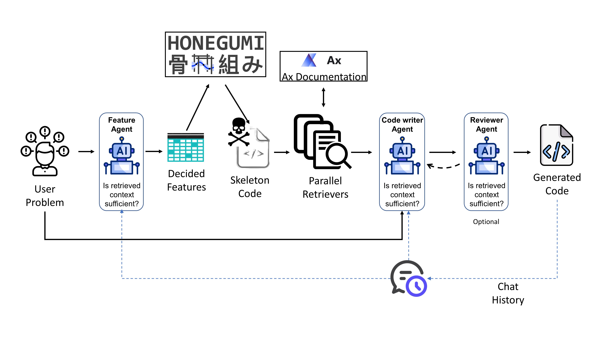

[](https://pyscaffold.org/)
[](https://honegumi-rag-assistant.readthedocs.io/en/latest/)
[](https://colab.research.google.com/github/hasan-sayeed/honegumi_rag_assistant/blob/main/notebooks/honegumi_rag_colab_tutorial.ipynb)
[](https://github.com/hasan-sayeed/honegumi_rag_assistant/issues)
[](https://github.com/hasan-sayeed/honegumi_rag_assistant/discussions)
[](https://github.com/hasan-sayeed/honegumi_rag_assistant/commits/main/)

# **Honegumi RAG Assistant**: Agentic Code Generation for Bayesian Optimization



*Figure: Schematic of the Honegumi RAG Assistant agentic pipeline for generating Bayesian optimization code from natural language.*

*An intelligent AI assistant that converts natural language problem descriptions into ready-to-run Bayesian optimization code using Meta's [Ax Platform](https://ax.dev/)*

---

## Overview

**Honegumi RAG Assistant** is an advanced agentic AI system that automatically generates high-quality, executable Python code for Bayesian optimization experiments. Built on top of [**Honegumi**](https://honegumi.readthedocs.io/en/latest/), it uses **LangGraph** and **OpenAI GPT models** to orchestrate multiple specialized agents that collaborate to understand your optimization problem, retrieve relevant documentation, and generate production-ready code using the [**Ax Platform**](https://ax.dev/).

[**Honegumi**](https://honegumi.readthedocs.io/en/latest/) provides deterministic skeleton code generation based on problem parameters, and this RAG Assistant enhances it by retrieving relevant [Ax Platform](https://ax.dev/) documentation to help the LLM transform the skeleton into complete, domain-specific code tailored to your problem.

Simply describe your optimization problem in plain English, and the assistant produces complete, runnable code tailored to your specific requirements.

### Key Capabilities

- **Natural language to code**: Describe optimization problems conversationally
- **Intelligent RAG**: Parallel retrieval of relevant Ax documentation to supplement skeleton code
- **Built on Honegumi**: Leverages [Honegumi](https://honegumi.readthedocs.io/en/latest/) for deterministic skeleton generation
- **Multi-agent architecture**: Specialized agents for parameter extraction, retrieval planning, and code writing
- **Flexible model selection**: Mix GPT-5 and GPT-4o models for cost-performance optimization

---

## Key Features

### Multi-Agent Architecture
- **Parameter Selector**: Analyzes problem and extracts optimization parameters (objective, constraints, task type etc.)
- **Skeleton Generator**: Uses [Honegumi](https://honegumi.readthedocs.io/en/latest/) to create deterministic code templates
- **Retrieval Planner**: Intelligently generates retrieval queries based on problem complexity
- **Parallel Retrievers**: For efficient documentation retrieval - multiple queries executed concurrently to minimize latency
- **Code Writer**: GPT-5 powered code generation with streaming output
- **Reviewer** (optional): Quality assessment and revision requests (disabled by default for speed)

### Advanced Features
- **LangSmith Integration**: Full tracing support for debugging and monitoring

---

## 🛠️ Prerequisites

- **Conda** (Miniconda or Anaconda)
- **Python 3.11+**
- [**OpenAI API key**](https://platform.openai.com/api-keys)
- [**LangSmith API key**](https://docs.smith.langchain.com/administration/how_to_guides/organization_management/create_account_api_key) (optional)

---

## 📘 Google Colab Tutorial

To help you get started quickly, we've prepared an interactive Google Colab tutorial:

**[Google Colab Tutorial: Getting Started with Honegumi RAG Assistant](https://colab.research.google.com/github/hasan-sayeed/honegumi_rag_assistant/blob/main/notebooks/honegumi_rag_colab_tutorial.ipynb)**

In this tutorial, you'll learn how to:

- Install Honegumi RAG Assistant and all necessary dependencies on Colab
- Set up API keys using Colab Secrets
- Build a vector store from Ax Platform documentation
- Describe your optimization problem and generate code
- View the generated code in your Google Drive

The tutorial runs entirely in Colab—no local setup required. All you need is access to your Google Drive and valid OpenAI/LangSmith API keys.

---

## Installation

### Quick Install via pip

1. Create & activate a conda environment
   ```bash
   conda create -n honegumi_rag python=3.11 -y
   conda activate honegumi_rag
   ```

2. Install via pip
   ```bash
   pip install honegumi-rag-assistant
   ```

3. Configure your API keys

   **Honegumi RAG Assistant** will automatically look for a file named `.env` in your current working directory (or any parent) and load any keys it finds.

   In the folder where you'll run the CLI (or in any ancestor), create a file called **`.env`** containing:

   ```bash
   OPENAI_API_KEY=sk-...
   LANGCHAIN_API_KEY=lsv2_...
   ```

4. Build vector store (one-time setup)
   
   For best results with documentation retrieval, build the vector store:
   ```bash
   # Download the build script
   wget https://raw.githubusercontent.com/hasan-sayeed/honegumi_rag_assistant/main/scripts/build_vector_store.py
   
   # Run it
   python build_vector_store.py --output ./ax_docs_vectorstore
   
   # Set the path in your .env
   echo "AX_DOCS_VECTORSTORE_PATH=./ax_docs_vectorstore" >> .env
   ```

5. Run the assistant
   ```bash
   honegumi-rag
   ```

### From Source: Clone & Run

1. **Clone the Repository**:
   ```bash
   git clone https://github.com/hasan-sayeed/honegumi_rag_assistant.git
   cd honegumi_rag_assistant
   ```

2. **Create Conda Environment** (recommended):
   ```bash
   conda env create -f environment.yml
   conda activate honegumi_rag_assistant
   ```

3. **Install in editable mode**:
   ```bash
   pip install -e .
   ```

4. **Configure API Keys**:
   
   In the project root directory, create a file called **`.env`** containing:
   
   ```bash
   # Required: OpenAI API Key for LLM and embeddings
   OPENAI_API_KEY=sk-your-actual-openai-api-key-here
   
   # Optional: LangChain for tracing (recommended for debugging)
   LANGCHAIN_API_KEY=your-langchain-api-key-here
   LANGCHAIN_TRACING_V2=true
   LANGCHAIN_PROJECT=Honegumi RAG Assistant
   
   # Optional: Path to FAISS vector store (if using RAG)
   AX_DOCS_VECTORSTORE_PATH=data/processed/ax_docs_vectorstore
   RETRIEVAL_TOP_K=5
   ```

5. **Build Vector Store for RAG**:
   
   For best results with documentation retrieval, run:
   ```bash
   # Build vector store (one-time setup)
   python scripts/build_vector_store.py
   ```
   
   The vector store will be saved to `data/processed/ax_docs_vectorstore/` and automatically loaded if present.

6. **Verify Installation**:
   ```bash
   honegumi-rag --help
   # Or: python -m honegumi_rag_assistant --help
   ```

---

## Usage

Run the assistant:

```bash
honegumi-rag    # if you installed via pip
# Or: python -m honegumi_rag_assistant
```

The assistant will prompt you to describe your Bayesian optimization problem in natural language:

```
Your problem:
Optimize temperature (50-200°C) and pressure (1-10 bar) for maximum yield in a chemical reaction.
```

After typing your problem description, press **Enter**. The assistant will process your problem and generate code in real-time (streaming), displaying it as it's created.

**By default, code is only printed to the console (not saved)**. To save the generated script to a file, use `--output-dir`:

```bash
honegumi-rag --output-dir ./my_experiments
```

**Optional: Enable debug mode** to see detailed agent decisions:

```bash
honegumi-rag --debug
```

### Command Line Arguments

| Argument | Description | Default |
|----------|-------------|---------|
| `--output-dir` | Save generated script to specified directory (if omitted, code is only printed, not saved) | `None` (no save) |
| `--debug` | Enable debug mode with detailed logging | `False` |
| `--review` | Enable Reviewer agent (slower, more accurate) | `False` |
| `--param-selector-model` | Model for Parameter Selector | `gpt-5` |
| `--retrieval-planner-model` | Model for Retrieval Planner | `gpt-5` |
| `--code-writer-model` | Model for Code Writer agent | `gpt-5` |
| `--reviewer-model` | Model for Reviewer agent | `gpt-4o` |


### Model Selection Guide

**Recommended (Best Quality)**:
```bash
--param-selector-model gpt-5 \
--code-writer-model gpt-5 \
--retrieval-planner-model gpt-5
```

**Budget (Faster, Lower Cost, Lower Accuracy)**:
```bash
--param-selector-model gpt-5-mini \
--code-writer-model gpt-4o \
--retrieval-planner-model gpt-5-mini
```

---

## Project Organization

```
├── AUTHORS.md              <- List of developers and maintainers
├── CHANGELOG.md            <- Changelog to keep track of new features and fixes
├── CONTRIBUTING.md         <- Guidelines for contributing to this project
├── LICENSE.txt             <- MIT License
├── README.md               <- This file
├── environment.yml         <- Conda environment specification
├── .env.example            <- Example environment variables (COPY TO .env)
│
├── configs/                <- Configuration files
│
├── data/
│   ├── raw/                <- Original, immutable data
│   └── processed/          <- Processed data (vector stores)
│       └── ax_docs_vectorstore/  <- FAISS vector store for Ax docs
│
├── src/
│   └── honegumi_rag_assistant/
│       ├── __init__.py
│       ├── __main__.py     <- CLI entry point
│       ├── orchestrator.py <- LangGraph pipeline orchestration
│       ├── app_config.py   <- Settings and configuration
│       ├── states.py       <- State definitions with custom reducers
│       ├── extractors.py   <- Pydantic schemas for structured extraction
│       └── nodes/          <- Agent implementations
│           ├── parameter_selector.py   <- Parameter extraction
│           ├── skeleton_generator.py   <- Honegumi skeleton generation
│           ├── retrieval_planner.py    <- Retrieval query generation
│           ├── retriever.py            <- Parallel FAISS retrieval
│           ├── code_writer.py          <- GPT-5 code generation
│           └── reviewer.py             <- Code quality review
│
├── scripts/
│   └── build_vector_store.py  <- Build FAISS vector store
│
├── tests/                  <- Unit tests (pytest)
└── docs/                   <- Documentation
```

---

## Advanced Topics

### LangSmith Tracing

Enable comprehensive debugging:

1. Get API key from https://smith.langchain.com/
2. Add to `.env`:
   ```
   LANGCHAIN_API_KEY=your-key
   LANGCHAIN_TRACING_V2=true
   LANGCHAIN_PROJECT=Honegumi RAG Assistant
   ```
3. View all LLM calls, agent decisions, and timing in LangSmith dashboard

---

## Citation

If you use Honegumi RAG Assistant in your research, please cite:

```bibtex
@software{honegumi_rag_assistant2025,
  title = {Honegumi RAG Assistant: Agentic Code Generation for Bayesian Optimization},
  author = {Sayeed, Hasan Muhammad},
  year = {2025},
  url = {https://github.com/hasan-sayeed/honegumi_rag_assistant}
}
```

---

## Contributing

We welcome contributions! Please see [CONTRIBUTING.md](CONTRIBUTING.md) for guidelines.

**How to contribute**:
1. Fork the repository
2. Create a feature branch (`git checkout -b feature/amazing-feature`)
3. Commit your changes (`git commit -m 'Add amazing feature'`)
4. Push to the branch (`git push origin feature/amazing-feature`)
5. Open a Pull Request

---

## License

This project is licensed under the MIT License - see [LICENSE.txt](LICENSE.txt) for details.

---

## Acknowledgments

- Built with [PyScaffold](https://pyscaffold.org/)
- Powered by [LangGraph](https://github.com/langchain-ai/langgraph) and [LangChain](https://github.com/langchain-ai/langchain)
- Skeleton generation by [Honegumi](https://honegumi.readthedocs.io/en/latest/)
- Uses Meta's [Ax Platform](https://ax.dev/) for Bayesian optimization

---

## Feedback & Feature Requests

This project demonstrates a **proof of concept** of what's possible with agentic systems for Bayesian optimization code generation. While Honegumi RAG Assistant works out-of-the-box for many scenarios, your use case may involve more complex pipelines, custom constraints, multi-objective optimization, or specific modeling needs.

Have something bigger in mind? Want Honegumi RAG Assistant to handle advanced features, integrate with your workflow, or adapt to your domain?

**We'd love to hear from you!**

- Open a [GitHub issue](https://github.com/hasan-sayeed/honegumi_rag_assistant/issues)
- Start a [GitHub discussion](https://github.com/hasan-sayeed/honegumi_rag_assistant/discussions)
- Or reach out directly at hasan.sayeed.71.93@gmail.com

Let's shape the future of agentic systems in optimization—together.

---

## Support

For questions, bug reports, or feature requests:
- **GitHub Issues**: https://github.com/hasan-sayeed/honegumi_rag_assistant/issues
- **Email**: hasan.sayeed@utah.edu

---

<!-- pyscaffold-notes -->

## Note

This project has been set up using [PyScaffold] 4.6 and the [dsproject extension] 0.7.2.

[conda]: https://docs.conda.io/
[pre-commit]: https://pre-commit.com/
[Jupyter]: https://jupyter.org/
[nbstripout]: https://github.com/kynan/nbstripout
[Google style]: http://google.github.io/styleguide/pyguide.html#38-comments-and-docstrings
[PyScaffold]: https://pyscaffold.org/
[dsproject extension]: https://github.com/pyscaffold/pyscaffoldext-dsproject
